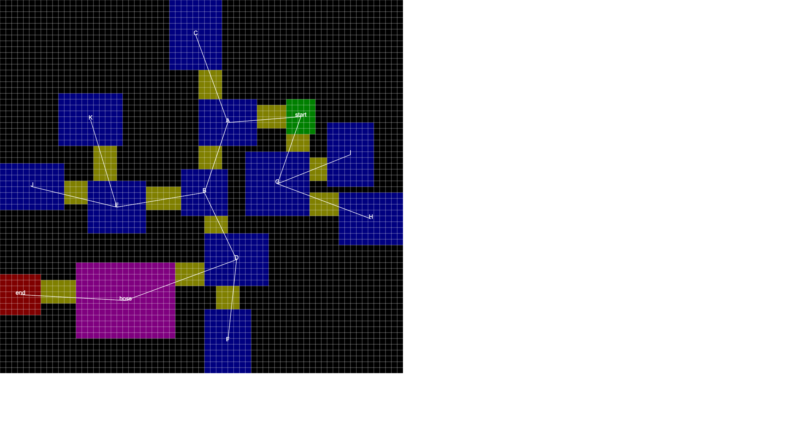
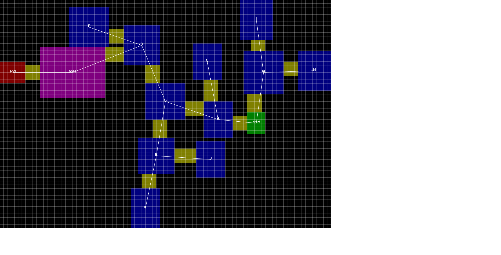
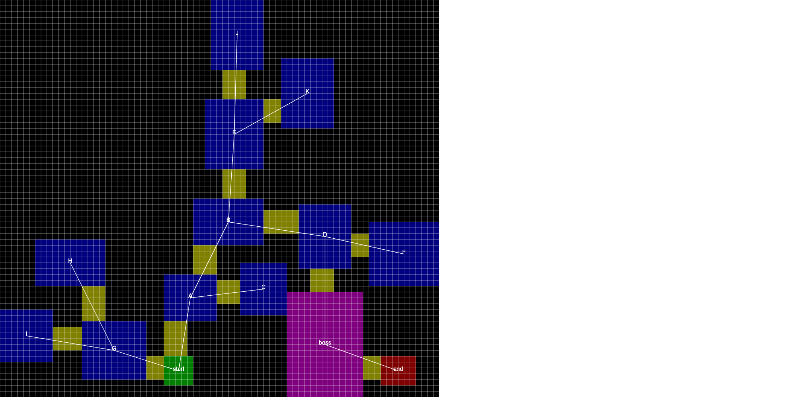
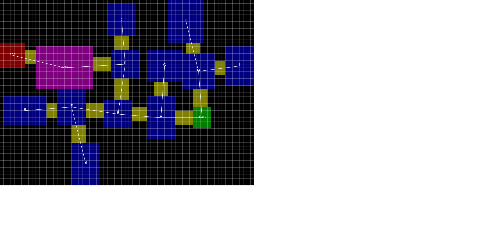

# Graph Dungeon Generator

---

**Hello fellow game developer 🧙‍♂️!**

**I need less than 5 minutes of your precious time, feedback, and experience, to answer a few questions about multiplayer game development that will help me shape future projects. Survey is available at https://tally.so/r/w81Xr5 and requires no signup and no bs.**

---

A simple graph-based procedural dungeon generator.

Want to play with the generator? [Try the demo here](https://halftheopposite.github.io/graph-dungeon-generator/) and have some fun 🧙‍♂️.

## Running the project

1. Clone the repository.
2. Run `yarn` to install dependencies.
3. Run `yarn dev` to build and run the project and listen for changes.
4. Finally, double-click the `public/index.html` file to open the generator in your browser.

## Examples

Given the same input graph, we can generate many dungeon shapes and pattern.

<table>
    <tr>
        <td></td>
        <td></td>
    </tr>
    <tr>
        <td></td>
        <td></td>
    </tr> 
</table>

## Architecture

The project is split into 3 distinct modules (aka folders) in an effort to separate concerns:

- `/generate`: where all the generation code lies (returns an `Node<Room>` tree).
- `/draw`: where we take the `Node<Room>` tree, generate a tilesmap, and render it to an HTML canvas with some debugging information.
- `/graphs`: the list of input files used to generate the dungeon. Currently written in TypeScript for type safety, but could as well be JSON files.

## What can it do?

- Generate a dungeon given a non-circular graph
- Backtracking when it cannot find a suitable spot for a child node
- Elegantly place the corridors between rooms
- Transform a node tree into a tilesmap
- Render contextual information for convenience
- Easily modifiable to add new room types and colors

## What can't it do?

This generator does not handle overly complex situations such as:

- Nodes with too many children
- L-shaped corridors
- Circular nodes (ex: A → B → C → A)

## Roadmap

- [x] Prevent rooms from joining which can disturb
- [ ] Pick from a set of predefined rooms that are rectangles
